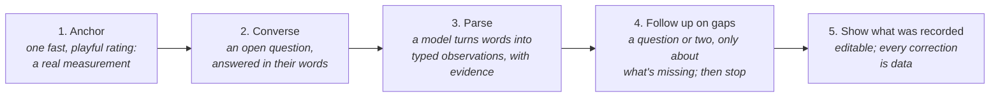

# Agentic steps for structured health data

**Anchor, then converse: how to make self-report something people want to do.**

*A case study in two apps, Probiome's gut log and affect-kit's check-ins. Draft, October 2026.*

---

## The problem: the data only exists if people fill it in

Every clinician knows the PHQ-9, the nine-question depression measure. It's free, validated, and takes two minutes. Almost nobody fills it in regularly:
- **Clinicians:** fewer than one in five behavioural-health clinicians measure outcomes routinely ([Lewis et al. 2019](https://doi.org/10.1001/jamapsychiatry.2018.3329)).
- **Health plans:** in US plans' 2023 quality data, a PHQ-9 was on record alongside a depression visit for 5–14% of members, depending on the plan type ([NCQA 2024](https://wpcdn.ncqa.org/www-prod/wp-content/uploads/Special-Report-Nov-2024-Results-for-Measures-Leveraging-Electronic-Clinical-Data-for-HEDIS.pdf)).
- **Apps:** across 93 popular mental-health apps, a median of 3.3% of users were still opening them 30 days after installing ([Baumel et al. 2019](https://doi.org/10.2196/14567)).

People will report, though, when the asking is light. Research diary studies, where people answer short prompts several times a day, average about 79% compliance ([Wrzus & Neubauer 2023](https://doi.org/10.1177/10731911211067538)). In one experiment, doubling a questionnaire's length cut compliance and raised careless answers, while asking more often made no difference ([Eisele et al. 2022](https://doi.org/10.1177/1073191120957102)).

So the problem isn't that people won't tell you how they are. It's the forms:
- **Too long.** They ask for too much at once.
- **Not their words.** They ask in the designer's vocabulary, so the person has to translate their day into "rate your mood 1–5".
- **One-way.** They give nothing back.

Self-report instruments work only if people fill them in. So: **how do you make something people want to do, whose back end still yields the structured data clinicians and researchers need, and whose front end gives the person something beautiful and useful?**

My answer is a pattern I've now built twice. Its heart is an agentic step: a model that turns someone's own words into typed, structured observations. Code decides what happens next, and the person always sees and corrects what was recorded.

## The pattern: anchor, then converse

1. **Anchor.** Start with one rating that's quick, a little fun, and a real measurement. It's the low-effort entry point, and it gives the model a prior for everything that follows.
2. **Converse.** Ask one open question ("What's going on?") and let people answer however they like.
3. **Parse.** A model turns their words into structured observations, each with the span of their words it came from, a confidence, and the model and prompt version that produced it.
4. **Follow up on gaps.** Code tracks what's covered. If something important is missing, ask about it in a sentence or two, then stop. There's a hard cap, and "that's it" always ends it.
5. **Show what was recorded.** The structure is visible as chips the person can change. A removed chip, a changed strength, an added word: each one is a labelled example.

## Instance one: Probiome's gut log

[Probiome](https://probiome.io) is a gut-health app I'm building.
- **The anchor** is a photo of a bowel movement, read as a Bristol stool type: a standard that clinicians have used for decades. It's surprisingly fun to do.
- **The conversation** opens with "How's your gut been treating you? Tell me about the last day or so."
- **The parse.** "Big salad, way more coffee than usual, slept like garbage" becomes *more fiber*, *much more caffeine* and *worse sleep*: each relative to the person's own normal, because people rarely know absolute amounts but always know whether today was different.
- **The follow-ups.** At most three, prioritized by what matters most for the microbiome.
- **The record.** The day's chips, editable.

**Two decisions from Probiome shaped everything since:**
- **The person's words are the source of truth.** Labels are derived from them, versioned, and re-run when the label list changes. Old extractions are superseded, not edited, so versions can be compared.
- **Labels are data, not schema.** The model can propose a new label ("ate a ton of mushrooms"), and a person approves it before it appears as a chip.

## Instance two: affect-kit check-ins

[affect-kit](https://affectkit.com) is an open-source set of web components for rating emotions. You drag a face around a pleasant-to-unpleasant, calm-to-activated plane, and the closest feeling words rise to the top, from 55 words with valence, arousal and dominance norms from the NRC VAD Lexicon. The face is pre-verbal and fast. The words are the measurement.

The closest thing already out there is [How We Feel](https://medicine.yale.edu/news-article/the-how-we-feel-app-helping-emotions-work-for-us-not-against-us/), made with the Yale Center for Emotional Intelligence. It puts 144 emotion words on Marc Brackett's Mood Meter, a grid of pleasantness and energy, for people to pick from. The check-in app changes the step that's most work: instead of picking words, you say them.

It works like this:
- **Anchor:** drag the face.
- **Converse:** "What's going on?", in a sentence.
- **Parse:** a model maps their words to affect-kit's feeling words. "Presentation went fine but I'm wiped. Kind of proud though" becomes *tired* (strongly, from "wiped") and *proud* (a little, from "kind of proud").
- **Show:** the words appear as chips, in the rater's own visual language, with each word's color from its place in the lexicon and its strength as rings. Tap to change, × to remove, add your own.

**Three things are different from the gut log, and they sharpened the pattern:**
1. **The vocabulary is fixed.** affect-kit's 55 words are validated, not a living list, so the model maps *into* a closed set. Words with no fit, like "relieved", "confused" or "focused", are kept as the person's own words, never forced into the nearest one. Their counts become evidence for the next vocabulary version.
2. **It touches mood.** That means crisis handling and strict wording rules for anything shown over time.
3. **So the model never talks.** Probiome's conversation uses a model to write warm replies. The check-in doesn't: every sentence the person reads is fixed text, and the model only reads.

## What I believe now

**The person's words are the record.**
- Everything structured is derived, versioned and re-derivable.
- The person's own corrections outrank every model, forever: a better model can be compared against history but never quietly rewrites it.

**Anchor with a real measurement.**
- A Bristol type and a face position are fast and playful, and they're measurements too.
- They also give the model a prior, which is worth testing rather than assuming (below).

**Models extract; code decides; fixed text speaks.**
- The model proposes structured data, as JSON checked against a schema. Plain, tested code decides what's kept, what's asked next and when to stop.
- Anything a person reads comes from one wording module that has its own tests.
- A model's output is untrusted input, so evidence is checked against the person's actual text and invented quotes are dropped.

**Show the structure, and learn from corrections.**
- If people can't see what was recorded, they can't trust it, and you can't learn from it.
- One caution: people tend to accept what they're shown, so "kept" isn't strong agreement. The honest measure is a blind pick (below).

**Evals before models, and baselines that need no model.**
- The agentic step is a port with an eval suite *before* any model is chosen.
- Two baselines set the floor: the anchor alone (no text at all) and a deterministic word matcher.
- Every candidate model runs with and without the anchor, and every result records time, tokens and cost.

**Logbook, not diagnostic.**
- The app describes what the person logged ("*calm* on 4 of 7 days") and never interprets it ("you're improving").
- No scores, no streaks, no "insights". Gaps are gaps, and nothing is drawn between two moments as if a feeling carried on between them.

**Safety is computed, not generated.**
- When someone's words suggest a crisis, crisis lines appear at once: from code, not a model, in calm fixed text, without blocking them, and without storing that it happened.
- Keeping the model out of the conversation also keeps the app on the right side of the new companion-chatbot laws.

**Privacy is a design input.**
- Run the models yourself, behind a gateway with logging off. Name every company that touches the data.
- Make deletion delete, and say how long backups last. For this app that's 30 days, and the privacy notice says so.

## First numbers

A hand-written test set of 48 check-ins, each labelled with the feeling words a person would most likely pick, built to break things:
- sarcasm ("Great, another flat tire");
- negation ("I'm not angry, just disappointed");
- words with no vocabulary fit ("relieved");
- events with no feelings at all ("Meetings all day, then groceries");
- a prompt-injection attempt.

The first comparison ran eight models that Cloudflare hosts, plus two baselines that need no model at all:

| | F1 | Typical / slowest |
|---|---|---|
| The face alone, no words | 0.17 | instant |
| Simple word matching | 0.77 | instant |
| **Llama 3.3 70B** | **0.94** | 2.0 s / 9.4 s |
| Llama 4 Scout | 0.81 | 1.5 s / 3.5 s |
| Qwen3 30B (3B active) | 0.76 | 4.5 s / 6.5 s |

Three things stood out:
- **The words carry the signal.** The face alone gets 0.17, so the conversation is pulling its weight.
- **The best model is a big generalist, and it's slow:** 2 seconds typically and 9 at the slowest. That's too slow for something you'd do six times a day. Speed will come from a cascade:
  - simple matching in the browser while you type;
  - a fast specialist for most check-ins;
  - the big model only for the hard ones.
- **Its mistakes are the human kind.** It read "Fantastic, the 4pm got moved to 6pm. Thrilled." as *excited*.

These are early and synthetic. Two people still have to label the set blind before any number means much, and published agreement between people labelling emotions in text is itself modest. On GoEmotions, three annotators agreed on a label for only 31% of items ([Demszky et al. 2020](https://doi.org/10.18653/v1/2020.acl-main.372)).

## Open questions

- **Agreement with the person, not with me.** The real target is the words the person would pick themselves. Annotators, and models, match each other better than they match the writer's own labels ([Kajiwara et al. 2021](https://doi.org/10.18653/v1/2021.naacl-main.169)). A blind-pick study answers it: on some check-ins, people pick words in the classic rater first, then write.
- **Does the anchor help the parser?** Every model runs with and without the face. If it doesn't help, that's a finding too.
- **Can check-ins map onto the PHQ-9 or GAD-7?**
  - At best, partly. Feeling words carry the affective items (feeling down, nervous, irritable) and miss sleep, appetite, concentration and psychomotor change.
  - Momentary ratings and two-week recall correlate only moderately ([Baryshnikov et al. 2023](https://doi.org/10.1016/j.jad.2022.12.127)).
  - Validating any mapping would take a clinical reference interview, pre-registration and ethics review. It would never put a score in a logbook.
- **Does naming feelings help?** Affect labeling quiets the amygdala in the lab ([Lieberman et al. 2007](https://doi.org/10.1111/j.1467-9280.2007.01916.x)), but its effects are contested and short-lived ([Nook et al. 2021](https://doi.org/10.1007/s42761-021-00036-y)). Repeated self-monitoring may sharpen how finely people tell emotions apart ([Widdershoven et al. 2019](https://doi.org/10.1016/j.jad.2018.10.092)). It's a question to measure, not a claim to make.
- **Who does it fail?** Dialects, slang, non-native English, other languages. The lexicon exists in about 100 languages; the model's competence in them is untested.

## What I'd measure

| Question | Measure |
|---|---|
| Do people want to do it? | Check-ins per day and completion over weeks, set against diary studies (~79%) and mental-health apps (~3% at 30 days) |
| Is it light? | Time from opening to Done |
| Is the parse right? | Edit rate per model version (removed, added, strength changed), and agreement with blind picks |
| Is the anchor pulling its weight? | Model scores with and without the face |
| Is it safe? | The crisis screen's recall on its test set (every case, every release), and a daily count of how often the crisis lines are shown, with no identifiers |
| Is it affordable? | Time and cost per check-in, per model |
| Does it give something back? | Whether people open their own day and week views, and the distinct words they use over time, described and never scored |

---

*Built in the open: the [check-in design and evals](checkin/README.md) and the [affect-kit package](https://github.com/savdevarney/affect-kit). Feeling words and their norms come from the NRC VAD Lexicon by Saif M. Mohammad, National Research Council Canada.*
