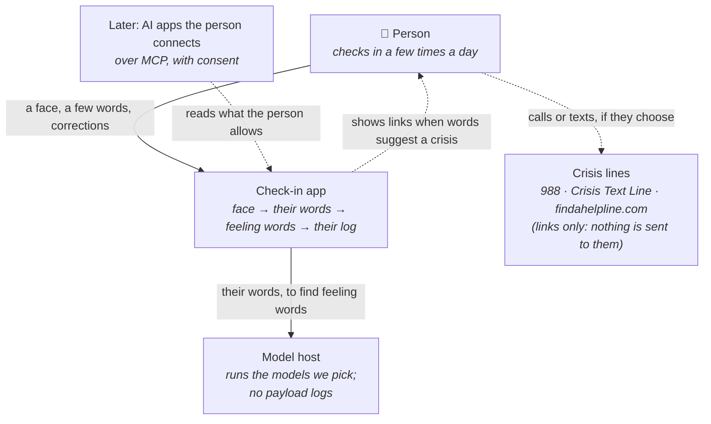
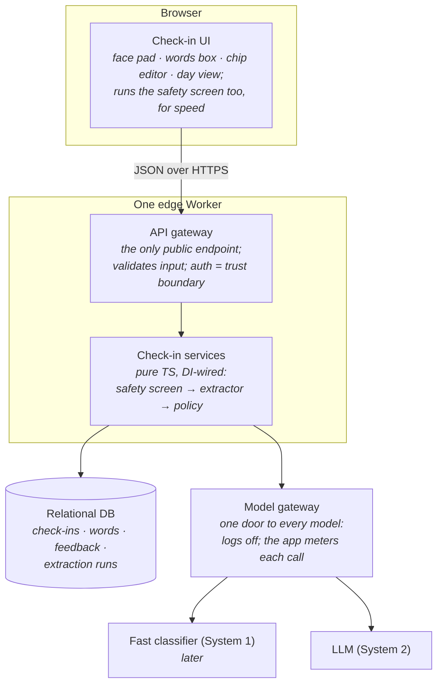
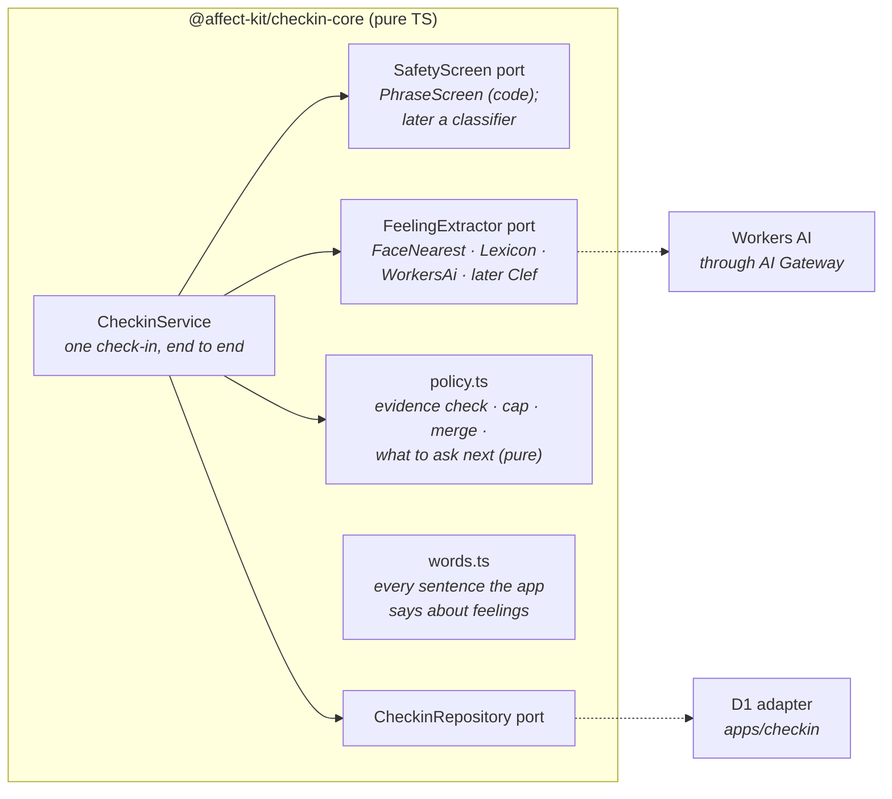
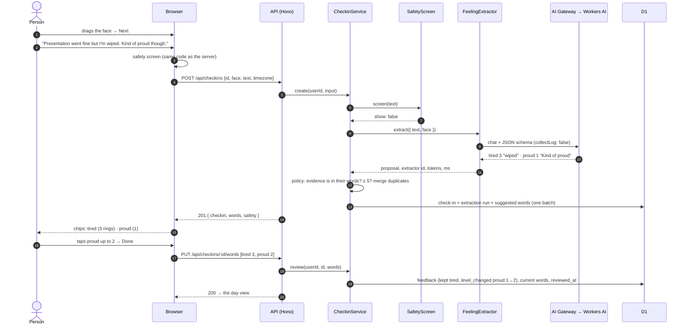
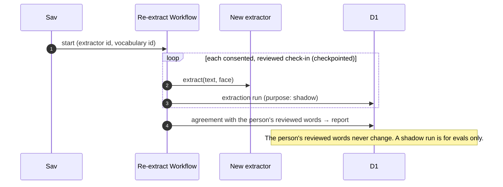
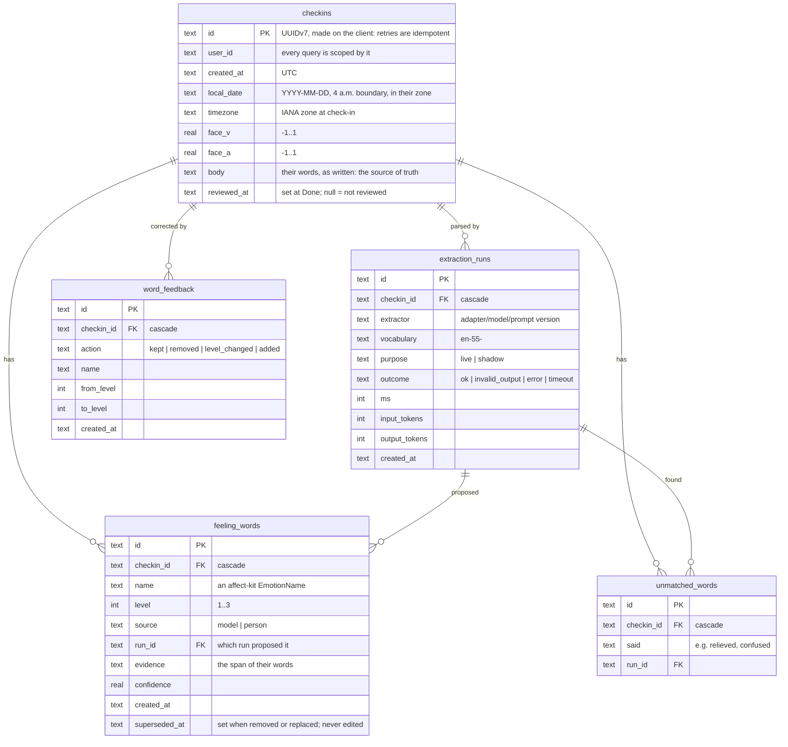

# Check-in: agentic emotion check-ins on affect-kit

**Status:** proposal, October 2026. Draft for Sav's review. The decisions marked *recommended* are being built in the first slice; each is easy to reverse, and the ones that are Sav's to make are listed at the end.

**The idea in one line:** a person drags the face to how they feel, says a few words in their own language, and an agent turns those words into affect-kit's feeling words, which the person checks and corrects. The app keeps a log of those words and shows it back, plainly.

Companion docs:
- [evals.md](evals.md): the eval-first plan for the agentic step.
- [visualizations.md](visualizations.md): day and week views, and the wording rules that keep them honest.
- [safety.md](safety.md): crisis handling, and the laws that touch mood apps.
- [clinical-instruments.md](clinical-instruments.md): PHQ-9 and GAD-7, as a research question.
- [privacy.md](privacy.md): what we store, who processes it, and deleting it.
- [The case study](../case-study-agentic-data-collection.md): the pattern, in plain words, for publishing.

## Contents

1. [The pattern, applied](#1-the-pattern-applied)
2. [Where it lives](#2-where-it-lives)
3. [Stack](#3-stack)
4. [Architecture (C4)](#4-architecture-c4)
5. [The observation schema](#5-the-observation-schema)
6. [The agentic step](#6-the-agentic-step)
7. [What changes in the affect-kit package](#7-what-changes-in-the-affect-kit-package)
8. [Build plan](#8-build-plan)
9. [Decisions for Sav](#9-decisions-for-sav)

## 1. The pattern, applied

Anchor, then converse ([the case study](../case-study-agentic-data-collection.md#the-pattern)), with Probiome's gut log as the first instance and this app as the second:

| Step | Probiome gut log | Check-in |
|---|---|---|
| **Anchor** | A stool photo becomes a Bristol type | The face on the V/A pad: fast, pre-verbal, a strong prior |
| **Converse** | "Tell me about the last day or so" | "What's going on?", in their own words |
| **Parse** | Typed observations (diet, sleep, mood…) with evidence | affect-kit feeling words with a level (1–3), the words they came from, and a confidence |
| **Follow up on gaps** | Up to 3 questions about uncovered topics | At most 1–2, only when no feeling word came through or a word is ambiguous (later) |
| **Show what was recorded** | Editable chips | Editable chips, in the rater's own chip style |

Two things are different here, and they shape the design:

1. **The vocabulary is fixed.** Probiome's labels are a living list; affect-kit's 55 words are a validated set that consumers can't extend (CONTRIBUTING › Scope). So the agent maps *into* a fixed vocabulary. Words that fit reasonably are mapped and quoted ("stressed" → *overwhelmed*, shown with "stressed" under it). Words with no fit ("relieved", "confused") are kept as their own words, never forced into the nearest one. Those words become evidence for future vocabulary versions instead (§ 6).
2. **It touches mood.** That brings crisis handling ([safety.md](safety.md)) and stricter wording ([visualizations.md](visualizations.md)). It also leads to one opinion this app holds more firmly than Probiome does: **the model reads; it never talks.** Everything the person reads is fixed text from one wording module. There is no model-written reply.

## 2. Where it lives

**Recommended: a new app in this monorepo, `apps/checkin`, with its logic in a private package, `packages/checkin-core`.**

| | In this monorepo | A separate repo on the published package |
|---|---|---|
| Co-evolving with the package | Same PR changes both (this slice needs two small package changes, § 7) | Publish, bump, then use: slower, but it proves the public API is enough |
| What the repo says about itself | affect-kit grows a reference app: "here's how to build on it responsibly" | The library stays a library |
| CI and contributors | Contributors cloning the library also get a Worker app (Wrangler, D1, Workers AI) | Untouched |
| Public by default | Yes: the repo is public from the first commit | Public or private, per repo |
| Precedent | Probiome started inside the `savdevarney` monorepo and moved out with `git subtree split` when it became a product | — |

**Why the monorepo now:** the slice depends on package changes, and the case study is about building *on* affect-kit. Being next to the package keeps that honest: if the app needs something, the package grows it in the open, under its own rules (fixed vocabulary, logbook not diagnostic).

**When to move it out:** if it becomes a product (other people's data, a business model), extract it the way Probiome was extracted. Probiome went private on 2026-10-04 because it might be valuable. If this one might be too, don't merge it here: extract it into a private repo and delete the PR branches. That's [decision 1](#9-decisions-for-sav).

**Boundaries** (thin apps, intelligence in packages):

```
packages/affect-kit/       the published library (two small additions, § 7)
packages/checkin-core/     private: schema, ports, adapters, policy, words, safety, evals
apps/checkin/              SvelteKit on a Worker: UI, the Hono API, D1, DI wiring
```

`checkin-core` never imports SvelteKit, Hono or D1. The app imports `checkin-core`, never the reverse. The eval harness runs `checkin-core` in Node with the same adapters the Worker binds.

## 3. Stack

| Concern | Pick | Why |
|---|---|---|
| UI | **SvelteKit** with affect-kit's web components | A learning target; custom elements work in Svelte as plain tags |
| Hosting | **One Cloudflare Worker** (`@sveltejs/adapter-cloudflare`, static assets) | UI and API in one deploy. Pages render in the browser (`ssr = false`): it's someone's own log, with nothing to index, and "today" depends on their time zone |
| API | **Hono**, mounted inside SvelteKit at `/api/*`, with Zod validators | One public API, typed end to end with Hono's RPC client (`hc<AppType>`), no codegen. Like Angular's typed `HttpClient`, except the types come from the server's routes. It can move to its own Worker behind a service binding later without changing a route |
| Services | **Pure TS + TSyringe** in `checkin-core` | Ports and adapters; explicit `@inject(TOKEN)` (Vite and Wrangler use esbuild, which emits no decorator metadata). A **child container per request**, like an Angular component-level injector, because Worker isolates are reused across requests |
| Database | **D1** (recommended over Supabase here) | See below |
| Models | **Workers AI, through AI Gateway, payload logging off** | Cloudflare-hosted (`@cf/`) models only; picked by evals ([evals.md](evals.md)) |
| Validation | **Zod** at every boundary: HTTP input, model output, DB rows | Model output is untrusted input |
| Tests | Vitest for pure logic; Playwright for the flow | As in the package |

**D1 or Supabase.** Supabase is Sav's default database, and Probiome uses it. For this app, D1 is recommended:

1. **One processor.** With D1, the person's words go to Cloudflare and nobody else: hosting, storage and models are one company on the privacy notice. With Supabase, it's two.
2. **The data is small and per person.** A few check-ins a day, a handful of words each. SQLite is plenty, and nothing needs Postgres features yet.
3. **Local dev without Docker.** Wrangler runs D1 locally; `supabase start` needs Docker.
4. **Learning.** Probiome already covers Supabase and Hyperdrive. This one covers D1, Wrangler migrations and the binding model.

**What it costs:**
- **No row-level security.** Every query is scoped by user id in one repository class, and tested.
- **No built-in auth.** The slice runs as a single local user. A private deploy goes behind Cloudflare Access. Real accounts are their own decision later ([privacy.md](privacy.md) › Accounts).
- **Recovery window.** D1's point-in-time recovery (Time Travel) is always on and keeps deleted rows recoverable for 30 days on the paid plan. The notice must say so, and it's longer than Probiome's 7 days ([privacy.md](privacy.md) § 4).

The repository is a port, so moving to Supabase later means writing one adapter.

**Considered and not chosen:**
- **A Durable Object per person**, each with its own SQLite: perfect isolation, live sync later, and it's the "actor per entity" of the reference architecture Sav's projects share. Not yet, because nothing is live, and the eval and research queries want one database. It's the natural next step if the app goes local-first or multi-device.
- **Workflows:** a check-in is one model call of a second or two, so a request can wait for it. Re-extracting history with a new model *is* a Workflow, later (§ 5).

## 4. Architecture (C4)

### Level 1: context



### Level 2: containers, generic first



| Block | Generic | Pick |
|---|---|---|
| UI | Web client | SvelteKit pages with `<affect-kit-rater face-only>`, `<affect-kit-face>` and chips styled like the rater's |
| API gateway | BFF / gateway | Hono at `/api/*` inside the SvelteKit Worker |
| Services | Stateless, DI-wired | `@affect-kit/checkin-core`, TSyringe child container per request |
| DB | Relational | D1 (SQLite), Wrangler migrations |
| Model gateway | Gateway (plumbing) | Cloudflare AI Gateway, logs off for the gateway and each request (`collectLog: false`); time and tokens recorded on each run |
| System 2 | LLM tier | A Workers AI model, picked by evals |
| System 1 | Typed classifier | Later: Clef-flash, or our own small model ([evals.md](evals.md) › The path to a fast classifier) |

Against the reference architecture Sav's projects share (a gateway Worker, an actor per entity, durable jobs, a database with an outbox): the gateway and the stateless services are here; the **actor per entity**, **durable jobs** and **outbox** aren't needed yet, because nothing is live and nothing is published to other systems. Each has a named trigger for when it arrives (§ 3, § 5).

### Level 3: components in `checkin-core`



### Sequence: a check-in (the first slice)



### Sequence: words that suggest a crisis

```mermaid
sequenceDiagram
    autonumber
    actor P as Person
    participant UI as Browser
    participant API as API
    participant S as CheckinService
    participant SS as SafetyScreen

    P->>UI: words that suggest self-harm or crisis
    UI->>UI: safety screen matches → crisis panel shows at once (static copy)
    UI->>API: POST /api/checkins
    API->>S: create
    S->>SS: screen(text) → show: true
    Note over S: policy: no follow-up questions; nothing model-written.<br/>The words are still theirs, so extraction runs and the check-in saves.<br/>The flag itself is not stored.
    S-->>UI: { checkin, words, safety: { show: true } }
    UI-->>P: crisis panel stays first: 988 (call or text), 741741, findahelpline.com, 911;<br/>their check-in below it, as usual
```

### Sequence: re-extracting history (later)



## 5. The observation schema

### How it maps onto `Rating`

affect-kit's `Rating` is `{ timestamp, face: {v, a}, labels: {name, level, vad?}[], composite }`. A check-in **holds more than a Rating** (the person's words, where each feeling word came from, corrections), and **the Rating is derived from it on read**:

```ts
// packages/checkin-core/src/rating.ts
import { createRating, type Rating } from 'affect-kit/data';

export function ratingOf(checkin: { createdAt: string; face: Face; words: readonly { name: EmotionName; level: Level }[] }): Rating {
  return createRating({
    face: checkin.face,                                            // the anchor: their gesture, never edited by a model
    labels: checkin.words.map(({ name, level }) => ({ name, level })),
    timestamp: Date.parse(checkin.createdAt),
  });                                                              // composite and per-word VAD come from the lexicon
}
```

This follows the package's own persistence advice: store `{ name, level }`, rehydrate VAD on read. `createRating` also throws on any name outside the vocabulary, so a bad label can't reach a Rating.

| `Rating` field | Comes from | Notes |
|---|---|---|
| `timestamp` | `checkins.created_at` | |
| `face` | `checkins.face_v`, `face_a` | The person's gesture. The model sees it as context and never changes it |
| `labels` | Current rows of `feeling_words` | At most 5 (the rater's cap); level 1–3 |
| `composite` | Computed by `createRating` | Never stored |
| (not in `Rating`) | `checkins.body`, `unmatched_words`, `word_feedback`, `extraction_runs` | Their words, out-of-vocabulary words, corrections, versions |

### Tables (D1)



### Rules

1. **Their words are the source of truth.** `checkins.body` is stored as written. Feeling words are derived and carry the run that proposed them.
2. **Rows aren't edited; they're superseded.** A removed or changed word gets `superseded_at`, and the new state is a new row. History stays comparable across versions (Probiome's rule).
3. **The person outranks every model, forever.** Once a check-in is reviewed, a new extractor never changes what the person sees. Re-extraction of reviewed check-ins goes to shadow runs, for evals.
4. **Every run records its version:** the extractor (adapter, model and prompt version) and the vocabulary. The vocabulary id is a content hash of `EMOTION_LABELS`, so a package bump that changes no words changes no id.
5. **Corrections are data.** Done writes one feedback row per word: kept, removed, level changed, or added. That's the flywheel's signal, with one big caveat: people tend to accept what they're shown. The fix is in [evals.md](evals.md) › Blind picks.
6. **Out-of-vocabulary words are kept, not forced.** "Stressed" stays "stressed" in `unmatched_words`. Their counts across people (with consent) are evidence for future vocabulary versions, which still go through the package's normal citation-backed review.
7. **Safety flags aren't stored.** They're computed from the words whenever needed, so the database never holds a list of people flagged for crisis.

**Later: what it was about.** "Anxious about the presentation" carries context as well as a feeling. A later slice adds an `observations` table: `about` labels from a living list (work, sleep, people, body…), proposed by the model and approved by a person, exactly like Probiome's labels. The word is "about", not "trigger": we record what the person connected, never a cause we inferred.

## 6. The agentic step

### Ports

```ts
/** Text (and the face, as a prior) → feeling words. Swappable; picked by evals. */
interface FeelingExtractor {
  readonly id: string;                        // adapter/model/prompt version, stored on every run
  extract(input: { text: string; face: { v: number; a: number } | null }): Promise<{
    words: { name: EmotionName; level: 1 | 2 | 3; evidence: string; confidence: number }[];
    unmatched: { said: string; evidence: string }[];
  }>;
}

/** Text → show crisis resources or not. Code first; never only a model. */
interface SafetyScreen {
  readonly id: string;
  screen(text: string): { show: boolean; rules: string[] };
}
```

**Adapters, simplest first:**
1. **FaceNearest:** no text at all, just the vocabulary words nearest the face, as the rater sorts them. It's the baseline that answers "what do the words add?"
2. **Lexicon:** deterministic word matching with a small synonym table, intensifiers ("a bit", "so") and negation ("not anxious"). It needs no model, so it's the fallback when a model fails, it runs on a phone, and it's how local dev works without Cloudflare credentials.
3. **WorkersAi:** an LLM with a JSON schema. The model is picked by evals.
4. **Later, System 1:** Clef-flash, or our own small classifier ([evals.md](evals.md)).

### Policy lives in code

The model proposes; plain TypeScript decides (`policy.ts`, pure and unit-tested):
- **Evidence check:** a word is kept only if its evidence is found in the person's text. This guards against invented evidence; dropped words are counted in evals.
- **At most 5 words**, the rater's cap, by confidence. Duplicates merge, keeping the stronger level.
- **No feeling words found:** show the three words nearest the face as unselected suggestions. Nothing is saved unless they tap one.
- **Model down or invalid output:** fall back to the lexicon, and say so quietly ("found with simple matching").
- **Later, follow-ups:** at most 2, from fixed templates:
  - nothing came through: "How did that leave you feeling?";
  - an ambiguous word: "When you say *stressed*, is it more anxious, overwhelmed or frustrated?", answered by tapping a chip.

  "Skip" and "that's it" end it at once.

**The model never writes to the person.** Probiome's intake has a reply-writer model, for warmth. A mood app shouldn't. Every sentence the person reads comes from `words.ts`, so nothing a model generates can drift into advice, interpretation or counselling, and the wording rules can be tested.

### Errors and limits

- Text is capped at 1,000 characters. A check-in is a moment, not a diary entry.
- A model call gets 8 seconds. On timeout the lexicon answers, and the run is recorded as `timeout`. Transient errors and invalid output fall back the same way, and every attempt is its own run.
- Model output is parsed with Zod; anything invalid is recorded, never shown.

## 7. What changes in the affect-kit package

Two small, general additions. Both go in the first slice's PR, with changesets:

1. **`affect-kit/data`: a side-effect-free entry** for `createRating`, `averageRatings`, `stripVad`, `rehydrate`, `EMOTION_LABELS` and the types.
   - **Why:** every entry today registers the custom elements, and Lit's browser build needs `HTMLElement`. Measured with Wrangler's bundler, a Worker that imports `affect-kit` bundles Lit's browser build (110 KB) and fails at start with `HTMLElement is not defined`. One that imports `affect-kit/data` is 6.6 KB and starts. Servers that store Ratings couldn't use the helpers until now.
   - **What stays the same:** the same public symbols, no new ones, and the internals stay internal.
2. **`<affect-kit-rater face-only>`:** the pad without the word chips. The submit button shows after the first placement, and `commit` carries `labels: []` and `composite: null`. It's for consumers who collect the words another way, such as a conversation.

Neither interprets anything. Both are capture and data, inside the package's position.

## 8. Build plan

| Slice | What | Status |
|---|---|---|
| **0. Plan** | These docs and the case study | This PR |
| **1. First vertical slice** | Package additions (§ 7); `checkin-core` (schema, ports, FaceNearest and Lexicon baselines, the Workers AI adapter, phrase safety screen, policy, words); the eval harness with the first hand-written test set and baseline numbers; `apps/checkin`: rate → say a sentence → editable chips → saved → day view; a week-view prototype on synthetic data | Built, in its own PR |
| **2. Dogfood** | Private deploy behind Cloudflare Access; the privacy page; Sav uses it for two weeks | |
| **3. Evals for real** | Two people label the test set blind (the human ceiling); compare models; pick one; prompt v2 | |
| **4. Follow-ups and "about"** | The gap questions; `about` labels from a living list, with review | |
| **5. System 1** | Clef-flash in shadow; a router in code | |
| **6. Research** | The blind-pick study; the PHQ-9 mapping question, with a partner and IRB ([clinical-instruments.md](clinical-instruments.md)) | |

## 9. Decisions for Sav

**First, before anything goes further: the NRC VAD licence.** The lexicon's home page, checked 2026-10-05, says three things:
- it "can be used freely for non-commercial research and educational purposes";
- "If interested in commercial use of the lexicon, contact the author";
- "Do not redistribute the data… You may not rent or license the use of the lexicon nor otherwise permit third parties to use it." ([NRC VAD](https://saifmohammad.com/WebPages/nrc-vad.html))

affect-kit publishes 55 of its entries, with their scores, in an MIT-licensed npm package. Its research page says the lexicon is "free for research and commercial use". That predates this app, but this app, and any commercial use of affect-kit, makes it matter. It's worth an email to Saif Mohammad (saif.mohammad@nrc-cnrc.gc.ca) to describe the use and ask, and a fix to the research page's wording either way.

The page also asks products to credit the lexicon in their About page and documentation. The check-in app's footer does.

Recommended, and in progress unless Sav says otherwise:

1. **Where it lives:** in this public monorepo, as `apps/checkin` and `packages/checkin-core`, with the case study in `docs/`. If it should be private, as Probiome now is, don't merge the slice: extract it into its own repo instead (§ 2).
2. **D1 over Supabase** for this app (§ 3).
3. **The two package additions** (§ 7), released as a minor version.
4. **The model never writes to the person:** fixed text only, including follow-ups (§ 6). It's also what keeps the app outside the companion-chatbot laws ([safety.md](safety.md) § 5).
5. **SvelteKit 2.70, not 3.0.** SvelteKit 3.0 and its new Cloudflare adapter shipped on 2026-10-01, four days before this was built. Version 3 replaces `platform.env` with `import { env } from 'cloudflare:workers'`. Upgrade in its own PR once 3.x has settled.

Yours to make, no rush:

6. **Directional views.** The week views and wording rules in [visualizations.md](visualizations.md) need Sav's OK before anything directional is built beyond the prototype.
7. **A name.** Avoid "companion": in California's SB 243 and New York's law, "companion chatbot" is a regulated category built around ongoing, human-like relationships ([safety.md](safety.md) › Laws). This app is a logbook with a parser, and its name should say so.
8. **The second annotator** for the human ceiling ([evals.md](evals.md) › The human ceiling).
9. **Training on people's words:** off by default, with its own opt-in, and never before the privacy page says so ([privacy.md](privacy.md)).
