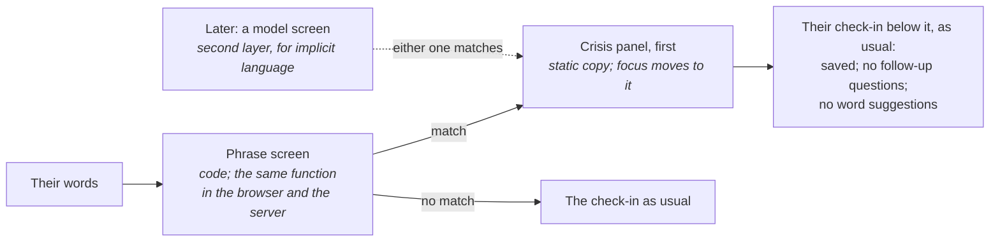

# Safety: when someone's words suggest a crisis

**Status:** design and first build, October 2026. Sources checked on 2026-10-05; services, numbers and laws change, so recheck before each release. Nothing here is legal advice. The laws section is a map for a lawyer, not a conclusion.

**The rule:** the agent is not a counsellor. Safety is computed in code and shown as fixed text. No model decides whether someone sees crisis resources, and no model writes what they read.

## 1. What happens

- **Detection is layered, and code comes first.** A phrase screen (`checkin-core/src/safety/phrase-screen.ts`) is tuned for recall. It runs in the browser the moment they press the button, so the resources appear even offline, and on the server. A model screen comes later, as a second layer for implicit language, and only ever adds to the phrase screen: either one showing the panel is enough.
- **It errs toward showing.** A false alarm costs a moment of someone's attention; a miss costs far more. The hyperbole people use every day ("this commute is killing me", "I want to die of embarrassment") is left out on purpose, and the safety set (§ 4) holds both kinds.
- **What they see:** the panel, first, in calm words (§ 3), with one-tap call and text links. Focus moves to it, so a screen reader announces it first.
- **What doesn't change:** their check-in saves as usual, because the words are theirs. Nothing is blocked; 988's own policy favours the least invasive step ([988 safety policy](https://988lifeline.org/wp-content/uploads/2023/02/FINAL_988_Suicide_and_Crisis_Lifeline_Suicide_Safety_Policy_-3.pdf)).
- **What's held back:** no follow-up questions, and no "words near your face" suggestions under the panel. Nudging someone's word choice under crisis resources is the wrong tone. They can still add words themselves.
- **No flag is stored.** The database never holds a list of people whose words matched. The screen is a pure function of the words, so it can be recomputed if ever needed. Section 5 recommends one exception: a daily count with no identifiers.

## 2. Resources

US first, because the app is. Wording follows what each service asks for.

| Line | What we show | Source |
|---|---|---|
| **988 Suicide & Crisis Lifeline** | "Call, chat or text 988", with call, text and chat links. SAMHSA's brand line is "call, chat or text 988" | [988 get help](https://988lifeline.org/get-help/), [SAMHSA brand standards](https://www.samhsa.gov/sites/default/files/988-branding-standards.pdf) |
| **988 in Spanish** | "Llama al 988 y oprime 2, o envía AYUDA al 988" | [988 get help](https://988lifeline.org/get-help/) |
| **Veterans Crisis Line** | "Dial 988 then Press 1", which is the VA's required wording, "or text 838255" | [VA branding one-pager](https://www.veteranscrisisline.net/media/rtpg0553/veterans-crisis-line-external-branding-one-pager_508-9-28-22.pdf) |
| **Crisis Text Line** | "Text HOME to 741741", with the service's full name. Its rules forbid abbreviations, "Suicide Hotline", and implying a partnership we don't have | [brand guidelines](https://www.crisistextline.org/brand-guidelines/) |
| **The Trevor Project**, for LGBTQ+ young people | "Call 1-866-488-7386, or text START to 678-678" | [Trevor get help](https://www.thetrevorproject.org/get-help/) |
| **Immediate danger** | "If you or someone else is in immediate danger, call 911." 988's platform toolkit treats a stated plan, time or place as imminent | [988 platform toolkit](https://988lifeline.org/wp-content/uploads/2022/07/SupportForSuicidalIndividuals_988.pdf) |
| **Outside the US** | Canada: "call or text 9-8-8". Elsewhere: findahelpline.com, which IASP points to | [988.ca](https://988.ca/), [IASP](https://www.iasp.info/crisis-centres-helplines/), [Find A Helpline](https://findahelpline.com/) |

**Things to know:**
- **988's LGBTQ+ youth option (Press 3)** ended on July 17, 2025 ([SAMHSA](https://www.samhsa.gov/about/news-announcements/statements/2025/samhsa-statement-988-press-3-option)) and came back on September 30, 2026 ([The Trevor Project](https://www.thetrevorproject.org/blog/the-trevor-project-applauds-the-return-of-the-988-lifelines-press-3-specialized-services-for-lgbtq-youth/)). Who now runs it, and how text and chat users reach it, weren't confirmed. Until they are, the panel lists The Trevor Project directly.
- **Find A Helpline's terms** (July 2025) forbid embedding it, or linking to it for commercial purposes, without permission ([terms](https://findahelpline.com/terms)). A plain link from a non-commercial reference app looks fine. **Ask ThroughLine before any commercial launch.**
- **Where the copy lives:** `checkin-core/src/safety/resources.ts`, with the check date. Recheck every number before each release.

## 3. How we write about it

From the Action Alliance's safe messaging guidance, #chatsafe, Reporting on Suicide, 988's toolkit for online platforms, the APA's November 2025 health advisory on AI chatbots and wellness apps, and the JED Foundation's 2025 position on AI ([Action Alliance](https://suicidepreventionmessaging.org/safety/messaging-donts), [#chatsafe](https://www.orygen.org.au/chatsafe), [Reporting on Suicide](https://www.save.org/wp-content/uploads/2026/05/ROS-One-Pager-2024.pdf), [988 toolkit](https://988lifeline.org/wp-content/uploads/2022/07/SupportForSuicidalIndividuals_988.pdf), [APA](https://www.apa.org/topics/artificial-intelligence-machine-learning/health-advisory-ai-chatbots-wellness-apps-mental-health.pdf), [JED](https://jedfoundation.org/artificial-intelligence-youth-mental-health-pov/)):

- **Lead with help and hope,** briefly: "You can talk to someone right now."
- **Calm, not alarming:** no red, no warning icons, no risk score, no "we're concerned about you".
- **Never describe methods,** never "committed suicide", and never present suicide as common or as a way of coping.
- **Be honest about what the app is:** "No one reads check-ins as they come in." Someone mustn't think a person saw their words and chose not to answer.
- **Don't act as a clinician:** connect them to people (988, Crisis Text Line, 911), and nothing else.
- **Keep risk entries out of model training.** Training is opt-in and off by default anyway ([privacy.md](privacy.md)); a matched entry would be excluded even with consent.

## 4. How it's tested

- **The safety set** (`checkin-core/evals/safety/cases.json`):
  - 21 cases that must show resources: explicit, passive, self-harm, *kms*, *unalive*, someone else ("my friend said she wants to die"), the past ("two years ago I attempted"), danger at home, and Spanish;
  - 11 that must stay quiet: hyperbole and ordinary sadness;
  - 3 that aren't scored, so the screen isn't tuned to our own edge cases.
- **It gates CI:** `evals/scoring.test.ts` fails the build if a crisis case stops showing resources. Today the phrase screen shows resources for all 21 and stays quiet for all 11.
- **Known gaps:**
  - implicit language ("I can't do this anymore") is the model screen's job;
  - other languages beyond basic Spanish;
  - eating-disorder language, which Washington's 2027 law requires covered bots to catch (§ 5);
  - deliberate misspellings.

  Each gap becomes test cases before it becomes rules.
- **The model screen, later:** Clef-flash with one yes/no question ("Does this text express thoughts of suicide or self-harm, or of being in danger?") returns a probability. Its threshold is set on the safety set with a recall target, and it's tested as a second layer, never as a replacement.

## 5. Laws that touch mood apps

Not legal advice: a map of what a lawyer should read before anyone else's data is involved. These are the laws found in force or pending on 2026-10-05.

| Law | Covers | Likely to cover this app? | Requires, if covered |
|---|---|---|---|
| **California SB 243**, in force since 2026-01-01 ([text](https://leginfo.legislature.ca.gov/faces/billTextClient.xhtml?bill_id=202520260SB243)); SB 1119 adds audits for minors from July 2027 ([text](https://leginfo.legislature.ca.gov/faces/billTextClient.xhtml?bill_id=202520260SB1119)) | A "companion chatbot": AI with "adaptive, human-like responses" that is "capable of meeting a user's social needs" and can "sustain a relationship" | **Probably not.** A model that picks labels from a fixed list isn't giving human-like responses. Model-written replies, a persona or conversational memory would change that | An AI disclosure, a published crisis-referral protocol, yearly reports to the Office of Suicide Prevention, a private right of action |
| **New York GBL Art. 47**, in force since 2025-11-05 ([text](https://www.nysenate.gov/legislation/laws/GBS/1700)) | An "AI companion" that simulates a sustained relationship. It must meet all three: it retains past interactions to personalize, asks "unprompted or unsolicited emotion-based questions", and sustains "an ongoing dialogue concerning matters personal to the user" | **Probably not, but it's the closest fit.** Mapping text to emotions resembles "emotional recognition", and scheduled reminders that ask how you feel resemble the second prong. Keep reminders free of emotion questions ("Time for a check-in", nothing more) | Detecting suicidal ideation and referring to services such as 988; an AI notice at the start and every 3 hours |
| **Illinois WOPR Act (HB 1806)**, in force since 2025-08-01 ([text](https://www.ilga.gov/Documents/legislation/publicacts/104/PDF/104-0054.pdf)) | AI therapy, meaning services "to diagnose, treat, or improve an individual's mental health" | **Exempt as self-help,** if we never claim to improve mental health. But licensed professionals may not let AI "detect emotions or mental states": **stop and check before any therapist uses the app with clients** | Only licensed professionals may offer therapy |
| **Nevada AB 406**, in force since 2025-07-01 ([text](https://www.leg.state.nv.us/Session/83rd2025/Bills/AB/AB406_EN.pdf)) | AI programmed to provide what would be professional mental health care | **Probably not,** with no clinical titles and no treatment claims | — |
| **Utah HB 452**, in force since 2025-05-07 ([code](https://le.utah.gov/xcode/Title13/Chapter72A/C13-72a_2025050720250507.pdf)) | Generative "mental health chatbots" holding therapy-like conversations | **Probably not:** there's no conversation | Disclosures, and no selling or sharing of health data |
| **Washington HB 2225**, from 2027-01-01 ([text](https://lawfilesext.leg.wa.gov/biennium/2025-26/Pdf/Bills/Session%20Laws/House/2225-S.SL.pdf)) | California's definition without the "social needs" element, so broader | **Watch.** It still needs human-like responses | A protocol that catches self-harm "including eating disorders", refers to crisis lines and blocks self-harm instructions, published in the app with yearly referral counts |
| **Oregon SB 1546**, from 2027-01-01 ([text](https://olis.oregonlegislature.gov/liz/2026R1/Downloads/MeasureDocument/SB1546/Enrolled)) | New York's three-part test | Probably not | A 988 hyperlink and a yearly public report |
| **Nebraska LB 525, Idaho S1297**, from 2027-07-01 | "Conversational AI", excluding outputs on "a narrow and discrete topic" | Probably excluded | — |
| **Tennessee SB 1580**, from 2026-07-01 | Presenting AI as a qualified mental health professional | Not if we never do | — |
| **FTC 6(b) inquiry**, 2025-09-11 ([FTC](https://www.ftc.gov/news-events/news/press-releases/2025/09/ftc-launches-inquiry-ai-chatbots-acting-companions)) | Seven companion-chatbot companies | A study; it places no duties on others | — |

**The design choices that keep us out of these definitions,** written down so a later feature doesn't drift across a line by accident:
- The model never writes to the person.
- There's no persona, no "relationship", and no memory used to steer a conversation.
- Reminders never ask emotion questions.
- We make no claim to treat or improve mental health, use no clinical titles, and show no scores.

**What we'll do even where it isn't required**, because it's right and it's what the stricter laws ask of the bots they cover:
- Publish this protocol (this page, in plain words, in the app).
- Count how often the panel shows: a daily total with no identifiers, so the count can never point at a person. Not built yet; it comes with the first deploy.

**FDA.** The General Wellness guidance reissued on 2026-01-06 counts "relaxation or stress management" as wellness. So is an app that "may help living well with anxiety", but not a claim that a product "helps treat an anxiety disorder" ([guidance](https://www.fda.gov/media/90652/download)). A mood logbook with no disease claims sits on the wellness side. A PHQ-9 score, a "depression risk" or a screening result does not ([clinical-instruments.md](clinical-instruments.md)).

## 6. What the app never does

- Writes to the person with a model, in crisis or otherwise.
- Counsels, diagnoses, scores risk, or labels anyone "at risk".
- Contacts anyone on the person's behalf. An emergency-contact feature would be its own decision, with its own consent and its own risks.
- Blocks the check-in, or hides their words from them.
